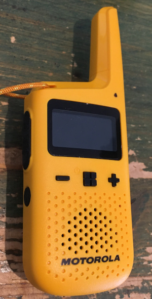
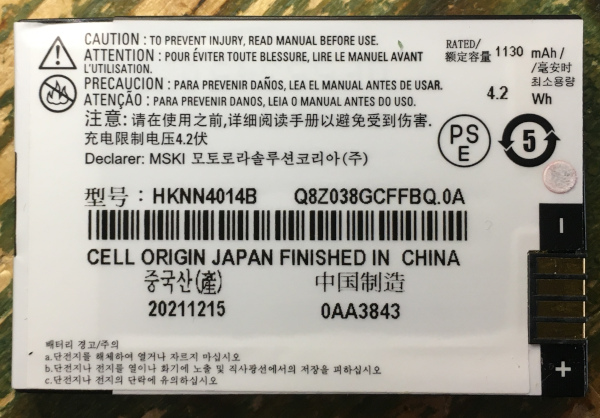

# Motorola T72 

#### Average current consumption measured with battery @ 3.7V

- RX idle (no audio) : 10 mA
- RX idle + IVOX : 20 mA
- RX + audio : 60 mA (will depends on the audio volume)
- TX : 260 mA
- RX in continuous channel monitoring mode : 82 mA (will depends on the audio volume)
- RX in continous scan mode: 64 mA

#### Battery: 

- Part No: HKNN401B
- rated 1130 mAh / 4.2Wh

#### Battery Gauge (on LCD display)

- Full if Vbat > 3.65V
- Low if Vbat < 3.37V
- Device turns off if Vbat <= 3.0V

