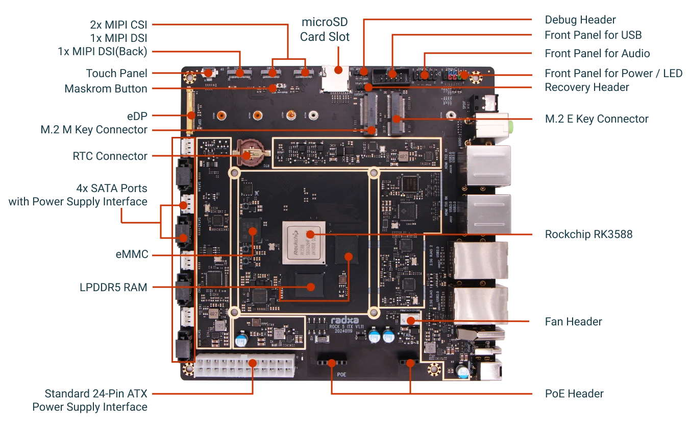

# Radxa ROCK5 ITX 

My QNAP TS419P+ is dying... Not only the debian kernel is no more maintained  for armhf (bookworm is the last release), but the SPINOR flash is dead (I need 20 attempts to correctly flash the last kernel image without corruptions, leaving the device unbootable during all those long 20 attempts...)

**Rock5 ITX is promising:**

- 4 SATA ports + 1 NVME slot
- ITX format (like the motherboard of the QNAP, I should be able to re-use the QNAP case)
- 12V power supply (I can re-use the QNAP PSU)
- 8 ARMv8 cores @2+GHz (vs. single ARMv5TE @1.6Ghz)
- Plenty of RAM (8BG vs 512KB)

## Interesting stuff:

### [Hardware tweaks](hardware_tweaks.md): Serial console, boot order switch

## My old QNAP TS419P+ 🪦

