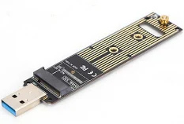
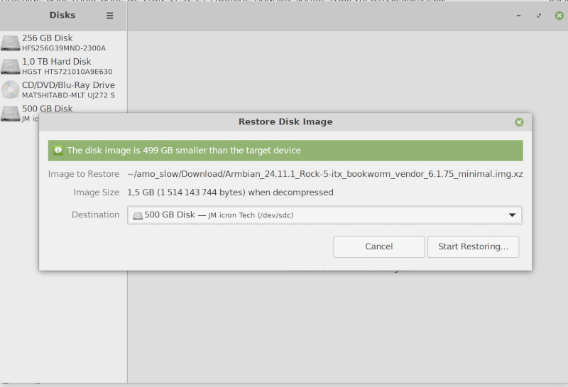
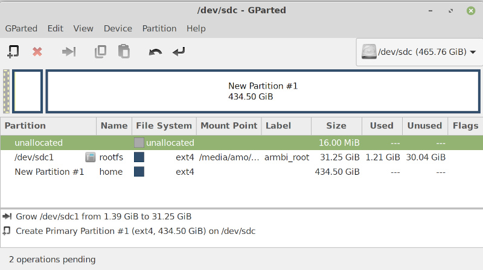

# Goal 

- Install Armbian "Minimal / IOT image"  from https://www.armbian.com/radxa-rock-5-itx/
- I want something that will be maintained and upgradeable for years, so not based on a vendor kernel. 
- I don't care about HDMI output or GPU. No screen will be attached. I'm only using the serial port for the install
- the main system will installed on a NVME driver. Multiple SATA drives will be grouped as a raid volume

Notes:

- A [serial console](hardware_tweaks.md) is **highly recommended** for this process.  


# Install the image

Image comes from https://dl.armbian.com/rock-5-itx/Bookworm_vendor_minimal

=> `Armbian_24.11.1_Rock-5-itx_bookworm_vendor_6.1.75_minimal.img.xz`

There are 2 ways to install it on nvme:

- install and booting on microSD first, then install from this boot session on the NVME drive.
- Plug your NVME drive on your linux PC with a USB<=> NVME adapter and install directly the system on it.

In both cases:

- the bootloader part (DDR init, uboot SPL, ATF, uboot) will be located on the SPINOR
- the eMMC module will be left unused
- the kernel and rest of OS will be located on NVME
- additional HDD will be mounted later with `/etc/fstab` edition

## Install from a microSD card

- from your PC Flash `Armbian_24.11.1_Rock-5-itx_bookworm_vendor_6.1.75_minimal.img.xz` on the microSD card
- install the microSD into the Rock5-ITX slot
- install the empty NVME drive
- power on the board

- Open a console to perform the standard Armbian install until a proper `root` and default user are setup.

- From this console, logged as root

  - Check the NVME drive is correctly detected and ready

    ```
    root@rock-5-itx:~# ls /dev/nvme0*
    /dev/nvme0 
    ```

  - Prepare a SPINOR image from the armbian image on microSD (`/dev/mmcblk1`)

    ```
    dd if=/dev/zero of=zero.bin count=64  # 64*512 = 0x8000
    dd if=/dev/mmcblk1 \
       of=bootloader.bin skip=64 count=32704  # 32704 = 16*1024*1024/512-64
    cat zero.bin bootloader.bin > spinor_image.bin
    ```

  - Erase the eMMC (`/dev/mmcblk0`) to be sure nothing of a previous bootloader and OS is available

    ```
    dd if=/dev/zero of=/dev/mmcblk0 count=65536
    ```

  - flash the `spinor_image.bin`

    ```
    flashcp -v spinor_image.bin /dev/mtd0
    ```

  - Copy the whole microSD (`/dev/mmcblk1`) into the NVME drive (/dev/nvme0)
    **Warning: the whole SSD content is erased**

    ```
    # be sure the FS will not be modified while we copy the content
    root@rock-5-itx:~# mount -f -o remount,ro /
    root@rock-5-itx:~# mount -f -o remount,ro /var/log.hdd/
    sync
    
    # copy the whole pow	microSD content to the NVME drive
    dd if=/dev/mmcblk1 of=/dev/nvme0 bs=4096
    sync
    
    # shutdown
    poweroff
    ```

- Now you can remove the microSD card and boot from SPINOR + NVME

Warning: the rootfs on your NVME drive has the same UUID than the rootfs on the microSD. If you plug both the microSD and the NVME drive, you will experience some issues. 

The UUID of the can be updated with `tune2fs -U [UUID] /dev/nvme0p1`, but you also need to update the UUID in:

- `/etc/fstab`

- `/boot/armbianEnv.txt`

  

## Install from a linux PC with a USB <=> NVME adapter



This is not the straightforward process but you have more opportunities to tune what you are doing. This kind of adapter will also be useful for easy troubleshooting later if you rock5-itx board has some issues.

- Plug your NVME SDD to your PC with the USB adapter.

- find on which `/dev/sdX` this drive is available. Either look at the log journal (`journalctl -r`), or if you want to use a Image flasher tool, this one will directly show the list of available devices.

- Copy the image manually or with an image flasher tool, exactly as if you install the image on a SD card

  - Manually

    ```
    unxz Armbian_24.11.1_Rock-5-itx_bookworm_vendor_6.1.75_minimal.img.xz
    sudo dd if=Armbian_24.11.1_Rock-5-itx_bookworm_vendor_6.1.75_minimal.img \
            of=/dev/sdX bs=4096
    ```

  - Or with a Disk Image writer tool
    

- Unplug the USB adapter and plug it again to let your PC detect the new content

- If you don't want armbian to use the full NVME drive for a single partition, you can use `gparted` or other partitioning tool to modify the partitions.

  For example, I will:

  - enlarge the rootfs to 32GB
  - provide a separated `/home` with the remaining space

  

  - to have this /home partition be mounted automatically, we need to add the entry into /etc/fstab file of the rootfs (previously mounted on the PC)

    ```
    $ blkid
    [...]
    /dev/sdc1: LABEL="armbi_root" UUID="65afcbeb-ccd6-4a33-8532-a8129a6b4cab" BLOCK_SIZE="4096" TYPE="ext4" PARTLABEL="rootfs" PARTUUID="3aace1d9-0a1c-3349-b14c-3dc091c74d17"
    /dev/sdc2: UUID="af66b5b8-3acf-4b92-b1c2-5971b21d6106" BLOCK_SIZE="4096" TYPE="ext4" PARTLABEL="home" PARTUUID="d1df4e37-b621-4ae9-b728-eb1acdf3b2b1"
    
    $ mount | grep armbi_root
    /dev/sdc1 on /media/amo/armbi_root type ext4 (rw,nosuid,nodev,relatime,errors=remount-ro,uhelper=udisks2)
    
    $ cd /media/amo/armbi_root/etc/
    $ sudo nano fstab
    [do the update]
    
    $ cat fstab
    UUID=65afcbeb-ccd6-4a33-8532-a8129a6b4cab / ext4 defaults,noatime,commit=120,errors=remount-ro 0 1
    tmpfs /tmp tmpfs defaults,nosuid 0 0
    UUID=af66b5b8-3acf-4b92-b1c2-5971b21d6106 /home  ext4 defaults,noatime,commit=120,errors=remount-ro 0 1
    ```

- You can also take the opportunity to make the UUID used by the rootfs unique and different from the original armbian image. This is important if you will need, in the future, to have the possibility to boot from the SD card and not mess with the image already written on you NVME SSD drive

  - With Gparted, select the `armbi_root` partition and use menu Partition /  New UUID.

  - run `blkid` to find the new UUID

    ```
    $ blkid 
    [...]
    /dev/sdc1: LABEL="armbi_root" UUID="ea0d2fe0-e0b7-42f6-ba26-509d788a003a" BLOCK_SIZE="4096" TYPE="ext4" PARTLABEL="rootfs" PARTUUID="3aace1d9-0a1c-3349-b14c-3dc091c74d17"
    [...]
    
    ```

    Here the new UUID is `ea0d2fe0-e0b7-42f6-ba26-509d788a003a`

  - remount  the `armbi_root` partition in order to update the UUID in 2 places

    - `etc/fstab`

      ```
      $ cat fstab 
      UUID=ea0d2fe0-e0b7-42f6-ba26-509d788a003a / ext4 defaults,noatime,commit=120,errors=remount-ro 0 1
      tmpfs /tmp tmpfs defaults,nosuid 0 0
      
      ```

    - `boot/armbianEnv.txt`

      ```
      $ cat armbianEnv.txt 
      verbosity=1
      bootlogo=false
      console=both
      overlay_prefix=rockchip-rk3588
      fdtfile=rockchip/rk3588-rock-5-itx.dtb
      rootdev=UUID=ea0d2fe0-e0b7-42f6-ba26-509d788a003ana
      rootfstype=ext4
      ```

- Last, extract the bootloader for `Armbian_24.11.1_Rock-5-itx_bookworm_vendor_6.1.75_minimal.img` and write it on the SPINOR flash.
  The bootloader is located between offset 0x8000 and 0x1000000 of the image (ie. the first 16MB).
  Range 0:0x8000 is the place for Gpt partition table. We must not copy it but replace by zeros.

  ```
  dd if=/dev/zero of=zero.bin count=64  # 64*512 = 0x8000
  dd if=Armbian_24.11.1_Rock-5-itx_bookworm_vendor_6.1.75_minimal.img \
     of=bootloader.bin skip=64 count=32704  # 32704 = 16*1024*1024/512-64
  cat zero.bin bootloader.bin > spinor_image.bin
  
  ```

  Write the image on SPINOR with latest [rkdeveloptool](https://github.com/rockchip-linux/rkdeveloptool) :

  - Power on the Radxa board while pressing the "maskroom" button.

  - See if the device is correctly detected

    ```
    $ sudo su
    $ echo -1 > /sys/module/usbcore/parameters/autosuspend  # rkdeveloptool works better with this first
    $ ./rkdeveloptool ld
    DevNo=1	Vid=0x2207,Pid=0x350b,LocationID=102	Maskrom
    ```

  - Erase and flash the SPINOR

    ```
    $ ./rkdeveloptool db  rk3588_spl_loader_v1.15.113.bin
    Downloading bootloader succeeded.
    
    $ ./rkdeveloptool cs 9  # select the SPINOR
    Change Storage OK.
    
    $ ./rkdeveloptool rfi
    Flash Info:
    	Manufacturer: SAMSUNG, value=00
    	Flash Size: 16 MB
    	Flash Size: 32768 Sectors
    	Block Size: 64 KB
    	Page Size: 2 KB
    	ECC Bits: 0
    	Access Time: 40
    	Flash CS: Flash<0> 
    	
    $ ./rkdeveloptool ef
    Erasing flash complete.
    
    $ ./rkdeveloptool wl 0 spinor_image.bin 
    Write LBA from file (100%)
    
    ```

  - You also need to be sure there is nothing left (bootloader, OS) in the eMMC, otherwise the Rock5-ITX may try to boot on eMMC

    ```
    $ ./rkdeveloptool cs 1  # select the eMMC
    Change Storage OK.
    
    $ ./rkdeveloptool rfi
    Flash Info:
    	Manufacturer: SAMSUNG, value=00
    	Flash Size: 7456 MB
    	Flash Size: 15269888 Sectors
    	Block Size: 512 KB
    	Page Size: 2 KB
    	ECC Bits: 0
    	Access Time: 40
    	Flash CS: Flash<0> 
    
    $ dd if=/dev/zero of=/tmp/zero.bin count=65536
    65536+0 records in
    65536+0 records out
    33554432 bytes (34 MB, 32 MiB) copied, 0,316269 s, 106 MB/s
    
    $ ./rkdeveloptool wl 0 /tmp/zero.bin 
    Write LBA from file (100%)
    
    ```

- Install the NVME drive back into the Radxa Rock5 ITX NVME slot

- PowerOn

Now, connect to a a console and finalize the armbian install. 