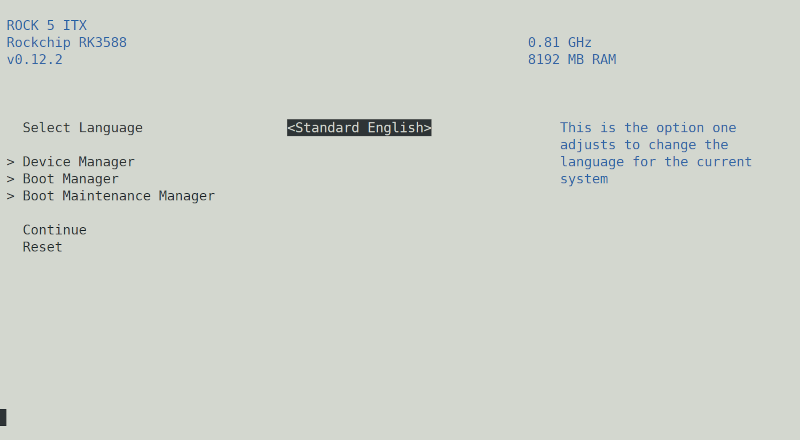

# Goal 

- Install Debian from official debian netinst ISO installer for arm64 to build a NAS based on Radxa ROCK5-ITX.
- I want something that will be maintained and upgradeable for years, so not based on a vendor kernel, but, if possible (and this is the case), based on generic arm64 kernel.

- I don't care about HDMI output or GPU. No screen will be attached. I'm only using the serial port for the install
- the main system will installed on a NVME driver. Multiple SATA drives will be grouped as a raid volume

Notes:

- A serial console is **highly recommended** for this process. Indeed, 
- Unfortunately **Bookworm kernel images don't have support for rk3588**. So currently, we only have access to future **Trixie** netinst images, which is still in Alpha.

# Image Download

## Debian Installer

Trixie alpha netinst image:

- https://www.debian.org/devel/debian-installer

- select the arm64 CD image: https://cdimage.debian.org/cdimage/trixie_di_alpha1/arm64/iso-cd/

## UEFI Booloader: EDK2

This generic arm64 debian image needs a UEFI bootloader to manage the boot. 

Good news, there is one for Rock5 ITX: https://github.com/edk2-porting/edk2-rk3588/releases

Currently, the latest image is v0.12.2: `rock-5-itx_UEFI_Release_v0.12.2.img`

Bad news is that the HDMI ports don't seem to work well for some displays. It needs to support 1080p@60Hz. But it may not be sufficient since my display supports such mode, but doesn't display anything.

# Prepare the various images

note: the `rkdeveloptool` used here is a patched version you can find here: https://github.com/amouiche/rkdeveloptool/releases/tag/v1.32%2Bchange_storage

## Prepare the embedded eMMC

eMMC should be erased to be sure the rk3588 will not try to boot on it. The Debian installer can do the partitioning later and use it as booting storage if you want to (not my case)

- Power the ROCK5-ITX board in Maskrom mode. Test to see if this is the case.

  ```
  ./rkdeveloptool ld
  DevNo=1	Vid=0x2207,Pid=0x350b,LocationID=102	Maskrom
  ```

- Load the rk3588_spl_loader in order to work on the different storage devices of the board

  ```
  ./rkdeveloptool db rk3588_spl_loader_v1.15.113.bin
  # Downloading bootloader succeeded.
  ```

  

- Select the eMMC storage and erase the first 16MB (note: `rkdeveloptool ef` doesn't work on eMMC, but we can still write zeros )

  ```
  dd if=/dev/zero of=/tmp/zero.bin count=32768
  # 32768+0 records out
  # 16777216 bytes (17 MB, 16 MiB) copied, 0,168244 s, 99,7 MB/s
  
  ./rkdeveloptool cs 1  # select the eMMC
  # Change Storage OK.
  
  ./rkdeveloptool wl 0 /tmp/zero.bin
  # Write LBA from file (27%)
  # Write LBA from file (79%)
  # Write LBA from file (100%)
  
  ```

## Flash the UEFI bootloader on SPINOR flash

```
./rkdeveloptool cs 9  # select the SPINOR
# Change Storage OK.

./rkdeveloptool rfi
# Flash Info:
# 	Manufacturer: SAMSUNG, value=00
# 	Flash Size: 16 MB
# 	Flash Size: 32768 Sectors
# 	Block Size: 64 KB
# 	Page Size: 2 KB
# 	ECC Bits: 0
# 	Access Time: 40
# 	Flash CS: Flash<0> 
	
./rkdeveloptool ef   # erase the whole flash
#Starting to erase flash...
#Erase Flash total 32768, current 32768
#Erasing flash complete.

./rkdeveloptool wl 0 rock-5-itx_UEFI_Release_v0.12.2.img
# Write LBA from file (21%)
# Write LBA from file (59%)
# Write LBA from file (100%)
```

### Copy the Debian netinst ISO on a SD card or on a USB drive:

**SD**: replace `/dev/mmcblkX` by the device SD card driver device on you PC

```
sudo dd if=debian-trixie-DI-alpha1-arm64-netinst.iso of=/dev/mmcblkX
```

**USB drive**: replace `dev/sdX`by the target USB drive device

```
sudo dd if=debian-trixie-DI-alpha1-arm64-netinst.iso of=/dev/sdX
```

You can also use various Image writer GUI to do the job.


# Install

Plug the SD card or the USB drive.

Open your serial console @1500000 bauds 

Turn the power on. E2DK is booting

```
DDR 9fa84341ce typ 24/09/06-09:51:11,fwver: v1.18
[...]
U-Boot SPL board init
U-Boot SPL 2017.09-g5f53abfa1e-221223 #zzz (Dec 26 2022 - 09:10:09)
Trying to boot from MMC2
MMC: no card present
[...]
Trying fit image at 0x800 sector
## Verified-boot: 0
## Checking atf-1 0x00040000 ... sha256(41d4a5b234...) + OK
## Checking edk2 0x00200000 ... sha256(8a0c608eb4...) + OK
## Checking atf-2 0x000f0000 ... sha256(e3b0c44298...) + OK
## Checking atf-3 0xff100000 ... sha256(f6c21c7eec...) + OK
## Checking optee 0x08400000 ... sha256(66e4b7a4cd...) + OK
## Checking nvdata 0x007c0000 ... OK
Jumping to U-Boot(0x00200000) via ARM Trusted Firmware(0x00040000)
Total: 630.736 ms

NOTICE:  BL31: v2.12.0(release):d5c68fd
NOTICE:  BL31: Built : 04:18:08, Jan  5 2025
UEFI firmware (version v0.12.2 built at 04:19:21 on Jan  5 2025)

```

After waiting few seconds (can be longer if you use the USB drive and/or if a ethernet cable is connected), the UEFI bootloader should find GRUB and run it


Now, everything is as usual with debian installer

- define the locale
- setup root and first user
- partitioning : use whatever storage you want: NVME, eMMC, ...
- etc...
- and finally, reboot

Unfortunately, the EDK2 UEFI bootloader doesn't detect automatically the new GRUB, we need to configure 

## ED2K post configuration

Halt the booting process with ESC or Ctrl+C in the console



- Boot Maintenance Manager
  - Boot options
    - Add Boot Option
      - Select the Volume where EFI partition was created by Debian installer
        - Find the 'grubaa64.efi' file
        - fill "Input the descirption" with a name
        - Commit changes and Exit
    - You can also "Delete Boot option", or "Change Boor order" to speed up the boot process.

Don't forget to save the new settings.

For other questions regarding EDK2, see https://github.com/edk2-porting/edk2-rk3588


## Device Tree and/or Overlays install (optional)

To install and use device tree overlays, EDK2 must be configured to search them.

- Enter EDK2 bootmenu
  - Device Manager
    - Rockchip Platform Configuration
      - ACPI / Device Tree
        - Support DTB override & overlays  <Enabled>
- Place `*.dbto` files in `[EFI_PARTITION_MOUNT_POINT]/dtb/overlays/rk3588-rock-5-itx/`,
   (`/boot/efi/dtb/overlays/rk3588-rock-5-itx/`in my case)
- You can also completely override the device tree embedded into the EDK2 image, and use the one you want to provide in `[EFI_PARTITION_MOUNT_POINT]/dtb/base/rk3588-rock-5-itx.dtb`