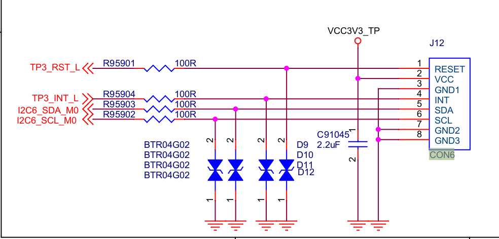

# Hardware tweaks

## Serial Console

Rock5 ITX provides a serial port very useful for:

- bootloader trace and control
- early kernel log
- installer CLI (debian, armbian...)
- useful bash console when ssh is not setup or network is broken.

Since it doesn't cost a lot (<10€), I highly recommend to install one in place and keep it available all the time.

The things to know: 

- **Voltage is 3.3V**. (Higher voltage (eg. 5V) may harm the ITX board.)
- baurate is 1500000 Hz


# Boot order selector

Rock5 ITX has a Maskrom button to force the SOC to boot in a mode where it can be controlled trough the USB-C connector by a PC for low level flash operations using [rkdeveloptool](https://github.com/rockchip-linux/rkdeveloptool).

- SPINOR erase/write/read
- eMMC erase/write/read

What is not written in documentation, but available in [schematic](resources/schematics/radxa_rock_5_itx_X1100_schematic.pdf), is the possibility to select booting the device order.


- Level 7 is the default mode : try to boot on SPINOR, then eMMC, then SD.

- Level 1 is the level when Maskrom key is pressed : only USB=Maskrom mode

- **Level 2 is interesting**: It allows to force booting on external SD card, even if a bootable OS is already installed. This allows to have a production system installed (eg. a working and configure NAS OS) while still being able to experiment new stuff (upgraded bootloaders, new kernels, other Linux distributions) on a SD card without touching the production system installed on eMMC or NVME drive.

A switch can be installed to apply a 20K resistor between BOOT_SARADC_IN0 and the ground.

##### 


## Addition UART3 on TP connector (J12 / CON6)

UART3 can be made available on TouchPannel Connector.



- **TP3_RST_L** is connected to **GPIO3_B5/UART3_TX_M1**

- **TP3_INT_L** is connected to **GPIO3_B5/UART3_RX_M1**

Enabling this UART and make it avaiable as `/dev/ttyS3` is a matter of adding a DeviceTree Overlay


```
cat > /tmp/rk3588-uart3-m1.dts << EOF
/*
 *  Enable UART3-M1.
 *  On Radxa ROCK 5-ITX, UART3 is available on TP connecteor (CON6), 
 *  TX on pin RESET and RX on pin INT.
 */
/dts-v1/;
/plugin/;

/ {
    compatible = "radxa,rock-5-itx";
	fragment@0 {
		target = <&uart3>;
		__overlay__ {
			 status = "okay";
			 pinctrl-0 = <&uart3m1_xfer>;
		 };
	 };
};

EOF

armbian-add-overlay /tmp/rk3588-uart3-m1.dts
```


