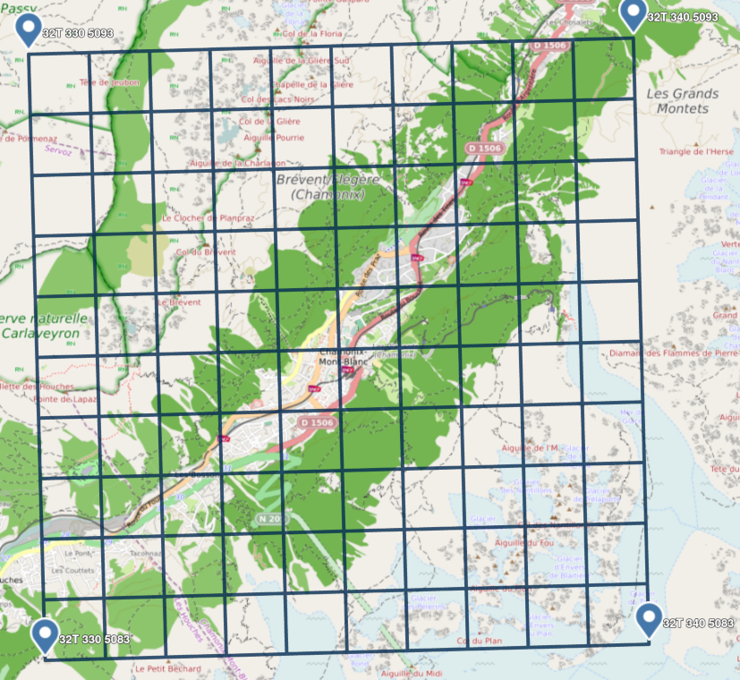

# utm_grid

Cet outil permet de générer un quadrillage aux coordonnées [UTM](https://fr.wikipedia.org/wiki/Transverse_universelle_de_Mercator) d'1km de côté (autres tailles de quadrillage possibles).

Le quadrillage est exportable en format KML ou GEOJSON pour pouvoir être importé dans votre outils de cartographie préféré (Gaia GPS, GuruMapsPro et Geoportail pour ceux que j'utilise)

#### Usage

```
usage: utm_grid.py [-h] [-W KM] [-H KM] [-q KM] [-z ZONE] [-p PERIOD] [-o FILE] [-f {geojson,kml}] lat,long

positional arguments:
  lat,long              Center GPS of the grid (will be rounded to the nearest UTM 1km grid location). You can use '/' prefix if the latitude is negative (ex: /-45.0,1.0

optional arguments:
  -h, --help            show this help message and exit
  -W KM, --width KM     Width of the Grid in km (default 10)
  -H KM, --height KM    Height of the Grid in km (default 10)
  -q KM, --square-size KM
                        size of each square in km (default 1)
  -z ZONE, --zone ZONE  Force a specific UTM zone
  -p PERIOD, --display-period PERIOD
                        Display UTM coords in the grid every PERIOD km
  -o FILE, --output FILE
                        Save result to this file
  -f {geojson,kml}, --format {geojson,kml}
                        File format (if not provided through filename extention)

```

#### Par exemple, si je suis à Chamonix (GPS 45.924, 6.870)

```
utm_grid.py -o utm_chamonix.kml "45.924, 6.870"
```

Permet, après import, d'obtenir une grille de la zone 32T, de 10km de large, chaque carreau ayant 1km de côté, le tout centré sur Chamonix.



(source: OpenStreeMap)